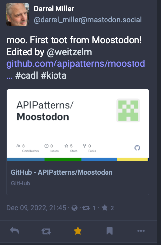

# The Moostodon Story: Describing a Real API

## Introduction
In our previous blog post Designing an API with [Cadl](https://microsoft.github.io/cadl/) we demonstrated the different capabilities of the Cadl API design language. We walked through the evolution of simple API design to take advantage of the reuse, partitioning and refactoring that is possible with Cadl and its tooling.

It is one thing to work with examples that were designed to show off the capabilities of Cadl, but to really prove its value it is more useful to show how it can be used to design a real API. For this post we will show how we created a description of the Mastodon API using Cadl. We will also show how we used the Cadl tooling to generate client libraries for the API in multiple different languages.

## What is Mastodon?

Mastodon is a federated social network. It is a decentralized alternative to commercial platforms like Twitter and Facebook. It is free and open source software, and it is a community of people who share a common interest in decentralization and free software. Mastodon is a federated social network. It is a decentralized alternative to commercial platforms like Twitter and Facebook. It is free and open source software, and it is a community of people who share a common interest in decentralization and free software.


The Mastodon API is a REST API that allows applications to interact with Mastodon instances. It is a very rich API that allows applications to do things like post toots, follow other users, and search for users. It also allows applications to interact with the underlying data model of Mastodon. For example, it allows applications to create new users, create new statuses, and create new media attachments.


Mastodon uses OAuth2 for authentication. This means that applications must first register with the Mastodon instance they want to interact with. The Mastodon instance will then provide the application with a client ID and client secret. The application can then use these credentials to request an access token from the Mastodon instance. The access token can then be used to authenticate requests to the Mastodon API.

> 
> ## Why Moostodon?
> 
> One of the curious aspects of the Cadl name is that many people hear 'cattle' when they first hear it pronounced. In keeping with the bovine theme and a certain amount of Canadian influence, Moostodon seemed like suitably silly name for this sample. We are working on a new "official" name for the project, but it's our hope that the bad cow puns will live on forever.

## State of the union

As far as HTTP APIs go, the Mastodon API is quite sizeable. It has more than a 100 endpoints and many different types of resource models.  It uses HTML forms for sending data and JSON payloads for returing data. A contributor to the Mastodon project recently submitted an [OpenAPI description](https://github.com/mastodon/mastodon/pull/20000/files) but at more than 5000 lines there is reluctance by the project to accept as it will require maintaining. Another [issue](https://github.com/mastodon/mastodon/issues/20572) is proposing the use of tooling to generate the OpenAPI description from the code as a more maintainable approach. While this strategy works for some projects, it is not a design first approach that is practiced by many teams. Cadl is a design first language that is more maintainable and get generate OpenAPI to be able to take advantage of the ecosystem of tooling that is available.

## Divide and conquer

Due to the size of the API, the first step in creating the API description was to divide the API into smaller pieces to make functionality easier to find.

One of the strenghts of Cadl is that it allows developers to think of their API in a more code-like manner. A top level construct introduced is the `@service` decorator, which is used to declare a `namespace`. Much like methods on a class, this allows developers to strucutre and organize operations.
> To learn more about the Cadl language and decorators, seel [Getting Started with Cadl](https://microsoft.github.io/cadl/getting-started).

```typescript
@service({
  title: "Mastodon",
  version: "1.0.0"
})
@route("/")
namespace MastodonApi {  

}
```
By attaching the `@route("/")` decorator to the namespace, all operations that are directly inside the `MastodonApi` namespace will be hosted at the root of the API.

Because Cadl is easy composable, through the use of `import` statements, the Mastodon API is decompesed into distinct files. In the following example the OAuthService is hosted at the `/oauth` path. The definition of the OAuthService is in a separate file that is imported into the main API description.

```typescript

@route("/")
namespace MastodonApi {  

  @route("oauth")
  interface oauthResource extends OAuthService {}

  @route("api/v1")
  namespace v1 {

    @route("accounts")
    interface AccountsResource extends AccountsService {}

  }

  @route("api/v2")
  namespace v2 {
  
    @route("search")
    interface SearchResource extends SearchService {}
  }
}
```

Over the years, the Mastodon API has evolved and some resource have been replaced by a V2 API.  However, only some of the resources exist in the V2 API so it is necessary to describe both the v1 and v2 APIs.  Cadl allows us to group these using nested namespaces. Cadl does have a rich versioning strategy, which will be covered in another post, but in the interst of simplicity, we'll add the `v2` as a new namespace.

## Reusable API patterns

This approach of creating a new "resource" interface that derives from the "service" interface is not absolutely necessary. If AccountService was defined directly in the `MastodonApi` namespace it could have a `@route("accounts")` decorator attached to it and by importing the file that contains the definition, the operations would be immediately available.  However, this approach does not allow us to reuse the `AccountsService` interface in other places. This can be seen in the following example:

```typescript
  @route("api/v1")
  namespace v1 {

    @route("accounts")
    interface AccountsResource extends AccountsService {}

    @route("mutes")
    interface MutesResource extends NamedSet<Account>{ }

    @route("blocks")
    interface BlocksResource extends NamedSet<Account>{ }

    @route("endorsements")
    interface EndorsementsResource extends NamedSet<Account>{ }
  }
```

In this example, the `MutesResource`, `BlocksResource` and `EndorsementsResource` all have the same shape. They are all sets of accounts that all support the same operations.  Just like code, we can refactor these oprations into an interface, `NamedSet` that can be reused in all three places. Because Cadl has a VS Code plugin, we are guided through this process with intellisense (and GitHub copilot). Since erorrors are caught by the Cadl compiler, we have a high degree of confidence that our refactoring is correct.

## Describing Operations

The definition of the `AccountsService` interface is in a separate file that is imported into the main API description using `import "./services/accounts.cadl";` at the top of the main Cadl file.

```typescript
interface AccountsService {
  // Register a new account.
  @post createAccount(
    @body body: CreateAccountForm
  ): Account | UnauthorizedResponse;

  // Search for accounts.
  @route("search")
  @get search(
    @query q: string, 
    @query limit: int32, 
    @query following: boolean, 
    @query resolve: boolean
  ): Account[] | UnauthorizedResponse;

  // Find familiar followers
  @route("familiar_followers")
  @get getFamiliarFollowers(
    @query id: string[]
  ): FamiliarFollowers[] | UnauthorizedResponse | UnprocessableContentError; 
}

```
This interface is limited to the operations that are either directly available at the `/api/v1/accounts` path or are available at a sub-path of that path. Cadl does not constrain how you group your operations. The approach followed here is based on trying to limit each interface to a reasonable number of operations. As organizations gain experience in designing APIs with Cadl, they will likely develop their own best practices.

## Reusing types

While there are sometimes opportunities to reuse interface patterns in an API, there are almost always opportunities to reuse type definitions in an API.  Cadl has a variety of ways to reuse types.

New models can be created based on other models and then have other decorators applied. In the examples below some common errors used in the are defined so they can be reused with friendly names.

```typescript
model UnprocessableContentError is Error {
    @statusCode statusCode: 422;
  }

model UnauthorizedError is Error {
    @statusCode statusCode: 401;
  }

```
Cadl has the interesting ability to combine the use of a model and the spread operator to define re-usable sets of parameters. The following `RangeParameters` are used in a number of places in the API.

```typescript
model RangeParameters {
  @query max_Id?: string;
  @query sinceId?: string;
  @query min_Id?: string;
  @query limit?: int32;
}

interface NamedSet<T> {
  @get items(...RangeParameters): T[];  
}

interface TimelinesService  {

  // Get public timeline
  @route("public")
  @get publicTimeline(
    @query local : boolean,
    @query only_media : boolean,
    ...RangeParameters
  ): Status[];

  // Get Home Timeline
  @route("home")
  @get getHomeTimeline(
    ...RangeParameters
  ) : Status[] | UnauthorizedResponse | NotFoundResponse;
  
}
```
Mastodon is unusual for HTTP APIs in that it uses `application/x-www-form-urlencoded` for most of its update operations. To indicate that a model will be sent as a form, the `@header` decorator is used to indicate the content type. The `Form` model was created as a template for all of the form models that are used in the API. In this case the `is` operator was used instead of `extends` to prevent an `allOf` being generated in the OpenAPI document to represent inheritance.

```typescript
model Form {
  @header contentType: "application/x-www-form-urlencoded";
}

model TokenForm is Form {
  grant_type: string;
  code: string;
  client_id: string;
  client_secret: string;
  redirect_uri: string;
  scopes: string;
}
```

All the examples shown here are excerpts from the complete Cadl description in the [Moostodon GitHub repo](https://github.com/APIPatterns/Moostodon/tree/main/spec). Using this description it is simple to create an OpenAPI description by compiling the Cadl from the spec folder.

```bash
cadl compile .\main.cadl
```

## Cadl & Open API

The [Moostodon](https://github.com/APIPatterns/Moostodon) project has the [Cadl](https://github.com/APIPatterns/Moostodon/tree/main/spec) files in the [spec folder](https://github.com/APIPatterns/Moostodon/tree/main/spec), along with the [generated Open API document](https://github.com/APIPatterns/Moostodon/blob/main/spec/cadl-output/openapi.json). Cadl creates artifacts through the concept of emitters. The Open API emitter will create a specification compliant with Open API V3.

Looking at the [main.cadl](https://github.com/APIPatterns/Moostodon/blob/main/spec/main.cadl) file we can immediately see many of the benefits of using a design first approach with Cadl:

- The size of the file itself is small--less than 100 lines of code. Compared with the Opean API document, which of overver 4,000 lines, this is much easier for developers to understand.
- Core concepts are encapsulated and reused. Just like developers understand how to use class libraries, they can now understand how to use API patterns.
- Reuse is inherent in the language through libraries
- Cadl is extrelemly flexible and can easily model complex APIs.

Now that we have generated an Open API document for our Moostodon service, you can use it to drive downstream tool chains. One common approach is to generate client code--let's do that now!

## Creating a client


