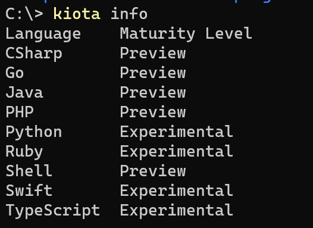

# The Moostodon Story: Describing a Real API

## Introduction

In our previous blog post Designing an API with [Cadl](https://microsoft.github.io/cadl/) we demonstrated the different capabilities of the Cadl API design language. We walked through the evolution of simple API design to take advantage of the reuse, partitioning and refactoring that is possible with Cadl and its tooling.

It is one thing to work with examples that were designed to show off the capabilities of Cadl, but to really prove its value it is more useful to show how it can be used to design a real API. For this post we will show how we created a description of the Mastodon API using Cadl. We will also show how we used the Cadl tooling to generate client libraries for the API in multiple different languages.

## What is Mastodon?

Mastodon is a federated social network. It is a decentralized, open source alternative to commercial platforms like Twitter and Facebook. The Mastodon API is a REST API that allows applications to interact with Mastodon instances. It is a very rich API that allows applications to do things like post toots, follow other users, and search for users. It also allows applications to interact with the underlying data model of Mastodon. For example, it allows applications to create new accounts, configure instances and manage the other instances a particular service interacts with.

Mastodon uses OAuth2 for authentication. This means that applications must first register with the Mastodon instance they want to interact with. The Mastodon instance will then provide the application with a client ID and client secret. The application can then use these credentials to request an access token from the Mastodon instance. The access token can then be used to authenticate requests to the Mastodon API.

## Why Moostodon?

One of the curious aspects of the Cadl name is that many people hear 'cattle' when they first hear it pronounced. In keeping with the bovine theme and a certain amount of Canadian influence, Moostodon seemed like suitably silly name for this sample. We are working on a new "official" name for the project, but it's our hope that bad cow puns will never be put out to pasture.

## State of the union

As far as HTTP APIs go, the Mastodon API is quite sizeable. It has more than a 100 endpoints and many different types of resource models.  It uses HTML forms for sending data and JSON payloads for returing data. A contributor to the Mastodon project recently submitted an [OpenAPI description](https://github.com/mastodon/mastodon/pull/20000/files) but at more than 5000 lines there is reluctance by the project to accept as it will require maintaining. Another [issue](https://github.com/mastodon/mastodon/issues/20572) is proposing the use of tooling to generate the OpenAPI description from the code as a more maintainable approach. While this strategy works for some projects, it is not a design first approach that is practiced by many teams. Cadl is a design first language that is more maintainable and get generate OpenAPI to be able to take advantage of the ecosystem of tooling that is available.

## Divide and conquer

Due to the size of the API, the first step in creating the API description was to divide the API into smaller pieces to make functionality easier to find.

One of the strenghts of Cadl is that it allows developers to think of their API in a more code-like manner. A top level construct introduced is the `@service` decorator, which is used to declare a `namespace`. Much like methods on a class, this allows developers to strucutre and organize operations.
> To learn more about the Cadl language and decorators, seel [Getting Started with Cadl](https://microsoft.github.io/cadl/getting-started).

```typescript
@service({
  title: "Mastodon",
  version: "1.0.0"
})
@route("/")
namespace MastodonApi {  

}
```

By attaching the `@route("/")` decorator to the namespace, all operations that are directly inside the `MastodonApi` namespace will be hosted at the root of the API.

Because Cadl is easy composable, through the use of `import` statements, the Mastodon API is decompesed into distinct files. In the following example the OAuthService is hosted at the `/oauth` path. The definition of the OAuthService is in a separate file that is imported into the main API description.

```typescript

@route("/")
namespace MastodonApi {  

  @route("oauth")
  interface oauthResource extends OAuthService {}

  @route("api/v1")
  namespace v1 {

    @route("accounts")
    interface AccountsResource extends AccountsService {}

  }

  @route("api/v2")
  namespace v2 {
  
    @route("search")
    interface SearchResource extends SearchService {}
  }
}
```

Over the years, the Mastodon API has evolved and some resource have been replaced by a V2 API.  However, only some of the resources exist in the V2 API so it is necessary to describe both the v1 and v2 APIs.  Cadl allows us to group these using nested namespaces. Cadl does have a rich versioning strategy, which will be covered in another post, but in the interest of simplicity, we'll add the `v2` as a new namespace.

## Reusable API patterns

This approach of creating a new "resource" interface that derives from the "service" interface is not absolutely necessary. If AccountService was defined directly in the `MastodonApi` namespace it could have a `@route("accounts")` decorator attached to it and by importing the file that contains the definition, the operations would be immediately available.  However, this approach does not allow us to reuse the `AccountsService` interface in other places. This can be seen in the following example:

```typescript
  @route("api/v1")
  namespace v1 {

    @route("accounts")
    interface AccountsResource extends AccountsService {}

    @route("mutes")
    interface MutesResource extends NamedSet<Account>{ }

    @route("blocks")
    interface BlocksResource extends NamedSet<Account>{ }

    @route("endorsements")
    interface EndorsementsResource extends NamedSet<Account>{ }
  }
```

In this example, the `MutesResource`, `BlocksResource` and `EndorsementsResource` all have the same shape. They are all sets of accounts that all support the same operations.  Just like code, we can refactor these operations into an interface, `NamedSet` that can be reused in all three places. Because Cadl has a VS Code plugin, we are guided through this process with intellisense (and GitHub copilot). Since errors are caught by the Cadl compiler, we have a high degree of confidence that our refactoring is correct.

## Describing Operations

The definition of the `AccountsService` interface is in a separate file that is imported into the main API description using `import "./services/accounts.cadl";` at the top of the main Cadl file.

```typescript
interface AccountsService {
  // Register a new account.
  @post createAccount(
    @body body: CreateAccountForm
  ): Account | UnauthorizedResponse;

  // Search for accounts.
  @route("search")
  @get search(
    @query q: string, 
    @query limit: int32, 
    @query following: boolean, 
    @query resolve: boolean
  ): Account[] | UnauthorizedResponse;

  // Find familiar followers
  @route("familiar_followers")
  @get getFamiliarFollowers(
    @query id: string[]
  ): FamiliarFollowers[] | UnauthorizedResponse | UnprocessableContentError; 
}
```

This interface is limited to the operations that are either directly available at the `/api/v1/accounts` path or are available at a sub-path of that path. Cadl does not constrain how you group your operations. The approach followed here is based on trying to limit each interface to a reasonable number of operations. As organizations gain experience in designing APIs with Cadl, they will likely develop their own best practices.

## Reusing types

While there are sometimes opportunities to reuse interface patterns in an API, there are almost always opportunities to reuse type definitions in an API.  Cadl has a variety of ways to reuse types.

New models can be created based on other models and then have other decorators applied. In the examples below some common errors used in the are defined so they can be reused with friendly names.

```typescript
model UnprocessableContentError is Error {
    @statusCode statusCode: 422;
  }

model UnauthorizedError is Error {
    @statusCode statusCode: 401;
  }
```

Cadl has the interesting ability to combine the use of a model and the spread operator to define re-usable sets of parameters. The following `RangeParameters` are used in a number of places in the API.

```typescript
model RangeParameters {
  @query max_Id?: string;
  @query sinceId?: string;
  @query min_Id?: string;
  @query limit?: int32;
}

interface NamedSet<T> {
  @get items(...RangeParameters): T[];  
}

interface TimelinesService  {

  // Get public timeline
  @route("public")
  @get publicTimeline(
    @query local : boolean,
    @query only_media : boolean,
    ...RangeParameters
  ): Status[];

  // Get Home Timeline
  @route("home")
  @get getHomeTimeline(
    ...RangeParameters
  ) : Status[] | UnauthorizedResponse | NotFoundResponse;
  
}
```

Mastodon is unusual for HTTP APIs in that it uses `application/x-www-form-urlencoded` for most of its update operations. To indicate that a model will be sent as a form, the `@header` decorator is used to indicate the content type. The `Form` model was created as a template for all of the form models that are used in the API. In this case the `is` operator was used instead of `extends` to prevent an `allOf` being generated in the OpenAPI document to represent inheritance.

```typescript
model Form {
  @header contentType: "application/x-www-form-urlencoded";
}

model TokenForm is Form {
  grant_type: string;
  code: string;
  client_id: string;
  client_secret: string;
  redirect_uri: string;
  scopes: string;
}
```

All the examples shown here are excerpts from the complete Cadl description in the [Moostodon GitHub repo](https://github.com/APIPatterns/Moostodon/tree/main/spec). Using this description it is simple to create an OpenAPI description by compiling the Cadl from the spec folder.

```bash
cadl compile .\main.cadl
```

## Cadl & OpenAPI

The [Moostodon](https://github.com/APIPatterns/Moostodon) project has the [Cadl](https://github.com/APIPatterns/Moostodon/tree/main/spec) files in the [spec folder](https://github.com/APIPatterns/Moostodon/tree/main/spec), along with the [generated OpenAPI document](https://github.com/APIPatterns/Moostodon/blob/main/spec/cadl-output/openapi.json). Cadl creates artifacts through the concept of emitters. The OpenAPI emitter will create a specification compliant with OpenAPI V3.

Looking at the [main.cadl](https://github.com/APIPatterns/Moostodon/blob/main/spec/main.cadl) file we can immediately see many of the benefits of using a design first approach with Cadl:

- The size of the file itself is small--less than 100 lines of code. Compared with the OpenAPI document, which of overver 4,000 lines, this is much easier for developers to understand.
- Core concepts are encapsulated and reused. Just like developers understand how to use class libraries, they can now understand how to use API patterns.
- Reuse is inherent in the language through libraries
- Cadl is extrelemly flexible and can easily model complex APIs.

Now that we have generated an OpenAPI document for our Moostodon service, you can use it to drive downstream tool chains. One common approach is to generate client code--let's do that now!

## Creating a client


There is an entire ecosystem of tooling built around OpenAPI documents. You can find many of them listed here on the [OpenAPI Tools page](https://openapi.tools/). There are a number of client SDK generators that can be used, but for this example we used Kiota.  

## Why Kiota?

[Kiota](https://microsoft.github.io/kiota) is an open source project developed by the Microsoft Graph Developer Experience team that is optimized for the API consumer experience. Because Microsoft Graph is a very large API we found that nobody builds an application that needs to call all of the APIs. Kiota enables selecting just the parts of the API the client application needs to call and generate out a client for their needs. This also lowers the barrier of learning a new SDK everytime there is a new API release. Because Cadl compiles OpenAPI documents that adhere to our standards, Kiota becomes more powerful and the two tools together promote a design first approach without sacrificing the ability to get to code quickly.

## Taking a tour of Kiota clients

In the [clients](https://github.com/APIPatterns/Moostodon/tree/main/clients) folder of the GitHub repository there are three example clients. The CSharp one is more developed than the Python and Node one, but they can all access public Mastodon APIs that are read-only.  The CSharp example can also get authentication tokens and do write operations.

The generated client code can be found in the `sdk` subfolders for each language and can be generated using the following command from the respective language folder:

```powershell
kiota generate --language typescript --output sdk  -d ..\..\spec\cadl-output\openapi.json --clean-output --class-name mastodonClient

kiota generate --language python  --output sdk  -d ..\..\spec\cadl-output\openapi.json --clean-output --class-name mastodonClient 

kiota generate --language csharp  --output sdk  -d ..\..\spec\cadl-output\openapi.json --clean-output --class-name mastodonClient --namespace-name MastodonClientLib --structured-mime-types application/x-www-form-urlencoded --structured-mime-types application/json --structured-mime-types text/plain
```

The variety of options provided to by the Kiota `generate` command enables configuring the features that are supported by the client code.  It would be inconvenient to have to remember all these options each time the OpenAPI description is updated and the client code regenerated.  To address this, the configuration options are preserved in a `kiota-lock.json` file that is stored in the output folder and so performing updates in the future is as simple as:

```powershell
kiota update --output sdk --clean-output
```

The generated code does have dependencies on some small core libraries that provide the native HTTP capabilities, serialization and authentication support.  You can discover what the necessary dependencies are with the `kiota info -l <language>` command. Other than the single Kiota.Abstractions library, all of the other dependencies are replacable by custom implementations.  

## Isolating the API client calls

The generated client code is a great starting point, but using it directly is not the ideal way of integrating it into a production application.  The first thing to do is to separate the client code into a service class.  This is a common pattern in application architecture and isolates the application logic from the mechanics of calling a specific API. It provides a great place to put an interface to enable testing your application with a mock API service.  The service class can also be used to manage the authentication token and to provide a higher level API to the client application.  The following code shows the service class for the C# client:

```csharp
public class MastodonService {

    private MastodonClient client;
    private OAuth2AuthorizationProvider _authProvider;

    public MastodonService(string baseUrl)
    {
        _authProvider = new OAuth2AuthorizationProvider(
                                CredsHack.ClientId,
                                CredsHack.ClientSecret,
                                "urn:ietf:wg:oauth:2.0:oob", 
                                baseUrl);

        // Use native HttpClient as the underlying HTTP library
        var requestAdapter = new HttpClientRequestAdapter(_authProvider);

        // Add support for form-urlencoded content type
        SerializationWriterFactoryRegistry
                      .DefaultInstance
                      .ContentTypeAssociatedFactories.Add(
                          "application/x-www-form-urlencoded",
                          new FormSerializationWriterFactory());

        client = new MastodonClient(requestAdapter);
        _authProvider.Client = client;  // Enable auth provider to use client
        requestAdapter.BaseUrl = baseUrl;  // Overwrite baseUrl from OpenAPI
    }
    ...
}
```

Within the `MastodonService` class we can create methods that perform the API functions our application needs with a simplified interface for the use-case.  An interesting side-effect of this pattern is that once you have done a couple of these helper methods, GitHub Copilot does a great job of implementing the methods from a simple descriptive comment.

```csharp
    // Get a specified account's followers
    public async Task<List<Account>> GetFollowers(string id, CancellationToken cancellationToken = default)
    {
        var followers = await client.Api.V1.Accounts[id].Followers.GetAsync(cancellationToken: cancellationToken);
        return followers;
    }
```

## More media types

Currently Kiota supports serialization of JSON and text content out of the box.  We will add support for more media types in the future.  In the meantime, you can add support for additional media types by adding a `SerializationWriterFactory` to the `SerializationWriterFactoryRegistry`. The following code shows how the Moostodon application added support for form-urlencoded content type:

```csharp
        // Add support for form-urlencoded content type
        SerializationWriterFactoryRegistry
                      .DefaultInstance
                      .ContentTypeAssociatedFactories.Add(
                          "application/x-www-form-urlencoded",
                          new FormSerializationWriterFactory());
```

When you do this, do not forget to tell Kiota that you now support this media type by adding it to the `--structured-mime-types` option when you generate the client code. Or y

Masotodon uses form-urlencoded content type write operations. By adding support for this media-type and describing in the Cadl/OpenAPI the use of that content type, the generated client code knows how to serialize the `CreateAppForm` object into the correct HTTP content.  

```csharp
    // Create an app
    public async Task<Application> CreateApp(string appName, string redirectUri, string scopes, string website, CancellationToken cancellationToken = default)
    {
        var app = await client.Api.V1.Apps.PostAsync(new CreateAppForm() {
            Client_name = appName,
            Redirect_uris = redirectUri,
            Scopes = scopes,
            Website = website
        }, cancellationToken: cancellationToken);
        return app;
    }
```

It is this kind of abstraction that massively simplifies the developer effort. The HTTP APIs can use the best media types for the scenario and client developer works with types that are most natural to them. The generated client code handles the mapping.

## Authentication us unavoidable

Adding a method to post a status is also seemingly very simple:

```csharp
    // Post a status
    public async Task<Status> PostStatus(string status, CancellationToken cancellationToken = default)
    {
        var newStatus = await client.Api.V1.Statuses.PostAsync(new CreateStatusForm() {
            Status = status
        }, cancellationToken: cancellationToken);
        return newStatus;
    }
```

However, in order to Post a status, the user must be logged in. Mastodon supports two different types of authentication flows. One is the OAuth2 Client Credentials flow that is used to acquire a token for an application. The other is the OAuth2 Authorization Code flow that is used to acquire a token for a user. Kiota has a plug-in model for authentication providers and we have implemented the OAuth2AuthProvider to enable the generated API client to request a new token when a request is made. This keeps the code that is calling the API, separated from token handling code, as can be seen in the aboce example, that posts a status on behalf a user but has no auth related code.

The following code shows two methods that the MastonService class exposes to enable the application to get the right kind of token before making an API call.

```csharp
    internal async Task LoginApp(CancellationToken cancellationToken = default)
    {
       await _authProvider.LoginApp(cancellationToken);
    }

    internal async Task LoginUser(string username, CancellationToken cancellationToken = default)
    {
        var url = _authProvider.GetUserAuthorizationUrl("write");
        //Display the url to the user and ask them to enter the code
        Console.WriteLine("Please open this url and sign in and copy code into console: " + url);
        Console.Write("Enter code: ");
        var code = Console.ReadLine();
        await _authProvider.LoginUser(code, cancellationToken);
    }
```

Moostodon is a console application, and very much a demo application, so we were able to take certain liberties here.  When logging in as a user, we will generate an AuthorizationUrl that can be used in a brower to allow login, perform consent for the specified scopes and aquire an authentication code.  That authentication code can be used to acquire a token.

The current implementation of the OAuth2AuthProvider only holds a single token and so it is necessary to perform the appropriate kind of Login prior to making any authenticated API calls.  Building a production quality `OAuth2AuthProvider` is out of scope of this sample.

## Languages, Languages, everywhere

As developers we have no shortage of choices when it comes to choosing a programming language.  Thankfully HTTP is a universal language and so we can use the same HTTP APIs from any language.  Kiota currently has support for a number languages and you can always check what is currently supported with the `info` command.

[

In the Node.js Typescript example the pattern of creating a MastondonService is followed and the service methods are very similar to those in the CSharp project. The Node.js example does not yet have an OAuth2AuthProvider and so only publicly accessible examples are included.

```typescript
    // Get the mastodon public timeline
    public async getPublicTimeline(): Promise<Status[] | undefined> {
        return await this._client.api.v1.timelines.public.get();
    }
```

The Python example is not significantly different.

```python
    def get_public_statuses(self) -> List[Status]:
        """
        Gets the statuses from the Moostodon API.
        Returns:
            The list of statuses.
        """
        statuses = asyncio.run(self.client.api().v1().timelines().public().get())
        return statuses
```

## Tools in the toolbox

Cadl and Kiota are new tools being developed by the Azure and Microsoft Graph developer experience teams to help developers produce and consume HTTP APIs. This post has hopefully demonstrated how these tools can be used with any HTTP API, regardless of the language or platform.  We are excited to see what you build with these tools.

Check out the [code](https://github.com/APIPatterns/Moostodon) and toot us at @weitzelm@mastodon.social, @darrel_miller@masotdon.social and @mikekistler@mastodon.social

Let's start a moovement!
